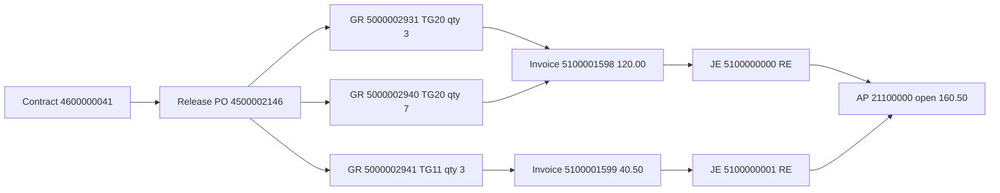

# Contract to Payment

Worked example of how ZEVO extracts line up from a quantity contract through the release purchase order, goods receipt, supplier invoice, and the universal journal.

ZEVO writes **one CDS per file** (and one CDS per `ExtractCds` call). It does not join documents. The client correlates them with the keys below. Machine-readable result of that correlation: [`docs/samples/c2p/correlation.json`](samples/c2p/correlation.json).

## Document flow



There is no inbound delivery on this chain (`DeliveryDocumentItem` is `000000`). There is no payment document in the extract. The vendor items stay open.

## Sample pack

Extract run `20261006_094549`, delimiter `;`. CSV headers are the CDS element names in uppercase. OData `$filter` uses the same names; the cookbook writes them in PascalCase (`PurchaseContract`).

| Folder | Contents |
|--------|----------|
| [`docs/samples/c2p/source/`](samples/c2p/source) | The extracts as received |
| [`docs/samples/c2p/seed/`](samples/c2p/seed) | Rows for contract `4600000041` and PO `4500002146`, plus supplier `0001000559` and the three G/L accounts those journal lines use |
| [`docs/samples/c2p/correlation.json`](samples/c2p/correlation.json) | Joined chain, quantity roll-up, join keys, gaps |
| [`docs/samples/c2p/build_seed.py`](samples/c2p/build_seed.py) | Rebuilds `seed/` and `correlation.json` from `source/` |

`I_BusinessPartner` and `I_GoodsMovementRefDocTypeText` in `source/` are Windows-1252. Everything else is UTF-8. The seed files are UTF-8.

### Why this contract and PO

`4600000041` is the only contract that is in the bounded contract header and item files **and** has a release order in the purchase-order file. PO `4500002146` is that release, and it continues through goods receipt, invoice, and the journal.

| Extract | Mode in the file name | Rows in source | Rows in seed |
|---------|----------------------|----------------|--------------|
| `C_PurchaseContractDEX` | bounded | 3 | 1 |
| `C_PurchaseContractItemDEX` | bounded | 9 | 3 |
| `C_PurchaseContractHistoryDEX` | full | 17 | 2 |
| `C_PurchaseOrderDEX` | bounded | 5 | 1 |
| `C_PurchaseOrderItemDEX` | bounded | 6 | 2 |
| `C_PurchaseOrderHistoryDEX` | bounded | 7 | 6 |
| `C_PurOrdAccountAssignmentDEX` | bounded | 0 | 0 |
| `I_GoodsMovementDocumentDEX` | bounded | 13 | 3 |
| `C_SupplierInvoiceDEX` | bounded | 2 | 2 |
| `C_SupplierInvoiceItemDEX` | bounded | 3 | 3 |
| `I_GLAccountLineItemRawData` | bounded | 178 | 11 (ledger `0L`) |
| `I_GLAccount` | full | 34812 | 3 |
| `I_BusinessPartner` | full | 434 | 1 |
| `I_BusinessPartnerSupplierDEX` | full | 155 | 1 |
| `I_GoodsMovementRefDocType` / `Text` | full | domain | code `B` only |

## Worked example

Company code **1710**, purchasing organization **1710**, purchasing group **001**, currency **USD**, payment terms **0003**.

Supplier **0001000559**, business partner name **EVOLVER DOMESTIC SUPPLIER 1** (`I_BusinessPartner.BusinessPartnerFullName`). The same number is the supplier on `I_BusinessPartnerSupplierDEX` (account group `SUPL`).

### 1. Quantity contract

`C_PurchaseContractDEX` / `C_PurchaseContractItemDEX`

| Field | Value |
|-------|--------|
| PurchaseContract | `4600000041` |
| PurchaseContractType | `MK` (quantity contract; document category `K`) |
| Supplier | `0001000559` |
| Validity | `20261002`–`20271231` |
| Created by | `ARIA` on `20261002` |

| Item | Material | Text | Target qty | Net price | Target amount |
|------|----------|------|------------|-----------|---------------|
| 00010 | TG10 | Trad.Good 10,PD,Third Party | 100 | 11.59 | 1,159.00 |
| 00020 | TG20 | Trad.Good 20,Reorder Point,SerialNo | 150 | 12.00 | 1,800.00 |
| 00030 | TG11 | Trad.Good 11,PD,Reg.Trading | 200 | 13.50 | 2,700.00 |

Unit `ST`, plant `1710`. Goods receipt and invoice are expected on every item. `InvoiceIsGoodsReceiptBased` is blank on the contract items.

Item **00010** has no release order in the full contract-history extract.

### 2. Release purchase order

`C_PurchaseContractHistoryDEX.ReleaseOrder` and `C_PurchaseOrderItemDEX.PurchaseContract` both point at this PO.

| Field | Value |
|-------|--------|
| PurchaseOrder | `4500002146` |
| PurchaseOrderType | `NB` |
| PurchaseOrderDate | `20261002` |
| Supplier | `0001000559` |
| PurchasingProcessingStatus | `05` |
| Header total (`PurgReleaseTimeTotalAmount`) | 315.00 |

| PO item | Contract item | Material | Order qty | Net price | Net amount | Storage location | GR-based invoice |
|---------|---------------|----------|-----------|-----------|------------|------------------|------------------|
| 00010 | 00030 | TG11 | 10 | 13.50 | 135.00 | 171A | blank |
| 00020 | 00020 | TG20 | 15 | 12.00 | 180.00 | 171B | `X` |

`AccountAssignmentCategory` is blank on both items. `C_PurOrdAccountAssignmentDEX` has a header and zero rows: this is stock procurement, not a cost-object PO.

Contract history (full extract) for this contract:

| Contract item | Release order | Release item | Qty | Net amount | Date |
|---------------|---------------|--------------|-----|------------|------|
| 00020 | 4500002146 | 00020 | 15 | 180.00 | 20261002 |
| 00030 | 4500002146 | 00010 | 10 | 135.00 | 20261002 |

### 3. Goods receipts

`C_PurchaseOrderHistoryDEX` where `PurchasingHistoryDocumentType` = `1` and `PurchasingHistoryCategory` = `E`. The history document number is the material document. `I_GoodsMovementDocumentDEX` carries the same number, movement type **101**, inventory transaction type **WE**, goods-movement reference document type **B** (“Goods movement for purchase order”).

| Material document | Year | PO item | Material | Qty | Amount | Posting date | Accounting document |
|-------------------|------|---------|----------|-----|--------|--------------|---------------------|
| 5000002931 | 2026 | 00020 | TG20 | 3 | 36.00 | 20261002 | 5000000001 |
| 5000002940 | 2026 | 00020 | TG20 | 7 | 84.00 | 20261005 | 5000000002 |
| 5000002941 | 2026 | 00010 | TG11 | 3 | 40.50 | 20261005 | 5000000003 |

The accounting document number is a different key. Join the material document to `I_GLAccountLineItemRawData` with `ReferenceDocumentType` = `MKPF` and `ReferenceDocument` = `MaterialDocument`.

Each goods receipt posts, on leading ledger `0L`:

| Account | Financial account type | Posting |
|---------|------------------------|---------|
| `0013600000` | `M` (stock) | Debit the receipt amount |
| `0021120000` | `S` (GR/IR, open-item managed) | Credit the receipt amount |

`AssignmentReference` on the GR/IR line is the PO and item concatenated: `450000214600020` and `450000214600010`. `PurchasingDocument` + `PurchasingDocumentItem` is the same link with the fields split.

### 4. Supplier invoices

`C_PurchaseOrderHistoryDEX` where `PurchasingHistoryDocumentType` = `2` and `PurchasingHistoryCategory` = `Q`. The history document number is the supplier invoice.

| Supplier invoice | Party reference | Gross | Status | PO item | Qty | Amount | Material document |
|------------------|-----------------|-------|--------|---------|-----|--------|-------------------|
| 5100001598 | SUPP.INV.0001 | 120.00 | 5 | 00020 | 3 | 36.00 | 5000002931 |
| 5100001598 | SUPP.INV.0001 | 120.00 | 5 | 00020 | 7 | 84.00 | 5000002940 |
| 5100001599 | SUPP.INV.0002 | 40.50 | 5 | 00010 | 3 | 40.50 | (none) |

Invoicing party on both headers is `0001000559`. Posting date `20261005`, company code `1710`, fiscal year `2026`. `IsInvoice` = `X`. Status `5` together with the RE journal below means the invoice is posted. Gross equals the sum of the item amounts; these journal lines have no separate tax account.

PO item 00020 is goods-receipt-based (`InvoiceIsGoodsReceiptBased` = `X`). Its invoice items store the material document in `PrmthbReferenceDocument`. PO item 00010 is not goods-receipt-based, and invoice `5100001599` leaves that reference empty. The PO history row for that invoice also leaves `ReferenceDocument` empty. Correlate item 00010 through `PurchaseOrder` + `PurchaseOrderItem`.

### 5. Invoice journal and open payable

Join `SupplierInvoice` to the journal with `ReferenceDocumentType` = `RMRP` and `ReferenceDocument` = `SupplierInvoice`.

| Supplier invoice | Accounting document | Type | Vendor line | GR/IR lines |
|------------------|---------------------|------|-------------|-------------|
| 5100001598 | 5100000000 | RE | `0021100000` credit 120.00, text `INVOICE SUPP.INV.0001` | debit 36.00 and 84.00 on `0021120000` |
| 5100001599 | 5100000001 | RE | `0021100000` credit 40.50, text `SUPP.INV.0002` | debit 40.50 on `0021120000` |

The vendor line (`FinancialAccountType` `K`) has an empty `PurchasingDocument`. The GR/IR lines on the **same** `AccountingDocument` carry `PurchasingDocument` `4500002146` and the PO item. `OffsettingAccount` on the vendor line is `0021120000`. `OffsettingAccount` on the GR/IR lines is supplier `0001000559`.

G/L master (`I_GLAccount`, chart `YCOA`, company `1710`) has no account-name column. The posting pattern and the account attributes identify the roles:

| G/L account | External | Reconciliation type | Open item managed | Role on this chain |
|-------------|----------|---------------------|-------------------|--------------------|
| 0013600000 | 13600000 |  |  | Stock, debited at goods receipt |
| 0021120000 | 21120000 |  | X | GR/IR |
| 0021100000 | 21100000 | K |  | Vendor payables |

GR/IR nets to **0.00** for the quantities received and invoiced. The same FI documents are also on ledger `2L`. The seed keeps ledger `0L`.

### Quantity roll-up

| Contract item | PO item | Material | Target | Released | Ordered | Received | Invoiced | Still to receive | Not released |
|---------------|---------|----------|--------|----------|---------|----------|----------|------------------|--------------|
| 00030 | 00010 | TG11 | 200 | 10 | 10 / 135.00 | 3 / 40.50 | 3 / 40.50 | 7 / 94.50 | 190 |
| 00020 | 00020 | TG20 | 150 | 15 | 15 / 180.00 | 10 / 120.00 | 10 / 120.00 | 5 / 60.00 | 135 |
| 00010 |  | TG10 | 100 | 0 | 0 | 0 | 0 | 0 | 100 |

Invoiced quantity equals received quantity on both released items. The open amount is unreceived quantity, not an invoice variance.

### 6. Payment

`ClearingDate` is `00000000` and `ClearingAccountingDocument` is blank on every seed journal line. Company 1710 in this extract has accounting document types `RE`, `RV`, `WA`, `WE`, and `WL`. There is no payment document.

Open vendor balance on `0021100000`: **160.50 USD** (120.00 + 40.50). That is the payment this chain is waiting for.

## Join keys

Use these in order. Field names are the CDS names (uppercase in the CSV).

| From | To | Keys |
|------|----|------|
| `C_PurchaseContractDEX` | `C_PurchaseContractItemDEX` | `PurchaseContract` |
| `C_PurchaseContractItemDEX` | `C_PurchaseContractHistoryDEX` | `PurchaseContract`, `PurchaseContractItem`. `ReleaseOrder` / `ReleaseOrderItem` is the PO. |
| `C_PurchaseContractItemDEX` | `C_PurchaseOrderItemDEX` | `PurchaseContract`, `PurchaseContractItem` |
| `C_PurchaseOrderDEX` | `C_PurchaseOrderItemDEX` | `PurchaseOrder` |
| `C_PurchaseOrderItemDEX` | `C_PurchaseOrderHistoryDEX` | `PurchaseOrder`, `PurchaseOrderItem`. History type `1` = goods receipt, `2` = invoice. |
| History type `1` | `I_GoodsMovementDocumentDEX` | `PurchasingHistoryDocument` = `MaterialDocument`, plus PO and item. Movement type `101`. |
| History type `2` | `C_SupplierInvoiceDEX` | `PurchasingHistoryDocument` = `SupplierInvoice`, plus `CompanyCode` and `FiscalYear` |
| `C_SupplierInvoiceItemDEX` | material document | `PrmthbReferenceDocument` = `MaterialDocument` when the PO item is GR-based |
| Material document | `I_GLAccountLineItemRawData` | `ReferenceDocumentType` = `MKPF`, `ReferenceDocument` = `MaterialDocument` |
| Supplier invoice | `I_GLAccountLineItemRawData` | `ReferenceDocumentType` = `RMRP`, `ReferenceDocument` = `SupplierInvoice` |
| Journal GR/IR line | PO item | `PurchasingDocument`, `PurchasingDocumentItem`. `AssignmentReference` is the same pair with no separator. |
| Journal vendor line | PO | Same `AccountingDocument` as the GR/IR lines. The vendor line itself has no `PurchasingDocument`. |
| PO supplier | `I_BusinessPartner` and `I_BusinessPartnerSupplierDEX` | `Supplier` = `BusinessPartner` |
| Journal line | `I_GLAccount` | `GLAccount`, `CompanyCode` |

`AccountingDocument` `5000000001` is the FI document for material document `5000002931`. `AccountingDocument` `5100000000` is the FI document for supplier invoice `5100001598`. The numbers are similar and they are different keys.

## Extract the same chain

File report `ZEVO_CDS_EXPLORER_2_FILE` already produced `source/`. To pull this chain again over OData, call `ExtractCds` once per entity (no `$expand`). Confirm names with `GetCdsMetadata` before relying on a field.

```http
GET /sap/opu/odata/sap/ZEVO_CDS_EXTRACT_SRV/ExtractCds
  ?EntityName='C_PurchaseContractDEX'
  &Filter='PurchaseContract eq ''4600000041'''
  &Format='jsonrows'
  &Skip='0'
  &Top='10'
  &$format=json
```

Then, still one entity per call:

| Step | EntityName | Filter |
|------|------------|--------|
| Contract items | `C_PurchaseContractItemDEX` | `PurchaseContract eq '4600000041'` |
| Release history | `C_PurchaseContractHistoryDEX` | `PurchaseContract eq '4600000041'` |
| PO header | `C_PurchaseOrderDEX` | `PurchaseOrder eq '4500002146'` |
| PO items | `C_PurchaseOrderItemDEX` | `PurchaseOrder eq '4500002146'` |
| PO history | `C_PurchaseOrderHistoryDEX` | `PurchaseOrder eq '4500002146'` |
| Goods movements | `I_GoodsMovementDocumentDEX` | `PurchaseOrder eq '4500002146'` |
| Invoice items | `C_SupplierInvoiceItemDEX` | `PurchaseOrder eq '4500002146'` |
| Invoice headers | `C_SupplierInvoiceDEX` | `SupplierInvoice eq '5100001598' or SupplierInvoice eq '5100001599'` |
| Journal | `I_GLAccountLineItemRawData` | `CompanyCode eq '1710' and FiscalYear eq '2026' and SourceLedger eq '0L' and (AccountingDocument eq '5000000001' or AccountingDocument eq '5000000002' or AccountingDocument eq '5000000003' or AccountingDocument eq '5100000000' or AccountingDocument eq '5100000001')` |
| Supplier | `I_BusinessPartner` | `BusinessPartner eq '0001000559'` |
| Supplier roles | `I_BusinessPartnerSupplierDEX` | `Supplier eq '0001000559'` |
| G/L | `I_GLAccount` | `CompanyCode eq '1710' and (GLAccount eq '0013600000' or GLAccount eq '0021100000' or GLAccount eq '0021120000')` |

`$filter` has no `in` operator. Chain `or` as in the [PO cookbook](../README.md#7-multiple-cds-header--items--history). A follow-on payment extract would be a later journal with `ClearingAccountingDocument` filled, or a payment document whose clearing fields point at `5100000000` and `5100000001`.

## Other rows in the same extracts

These are in `source/` and left out of `seed/` because they do not complete this contract.

- Contracts `4600000031` and `4600000040` are in the bounded header and item files and have no rows in the full contract-history file.
- Purchase orders `4500002142`, `4500002143`, `4500002144`, and `4500002145` are releases of contract `4600000038`. That contract is not in the bounded header or item files. Only `4500002143` has a goods receipt (material document `5000002930`, accounting document `5000000000`, supplier `0017300001` “Domestic US Supplier 1”, TG11 quantity 1, amount 15.00). None of those POs has a supplier invoice here.
- `I_GoodsMovementDocumentDEX` also contains movements that have no purchase order (movement types `501`, `412`, `631`, `601`). They are out of this flow.
- `I_GLAccountLineItemRawData` also contains company `1010` G/L journals and company `1710` sales documents (`RV` / `VBRK`). They do not reference PO `4500002146`.

## Rebuild the seed

From a clone, with the source CSVs in place:

```bash
python3 docs/samples/c2p/build_seed.py
```

The script rewrites `seed/` and `correlation.json`, and checks the chain: two PO items, three goods receipts, two invoices, eleven `0L` journal lines, GR/IR net `0.00`, open payables `160.50`.
