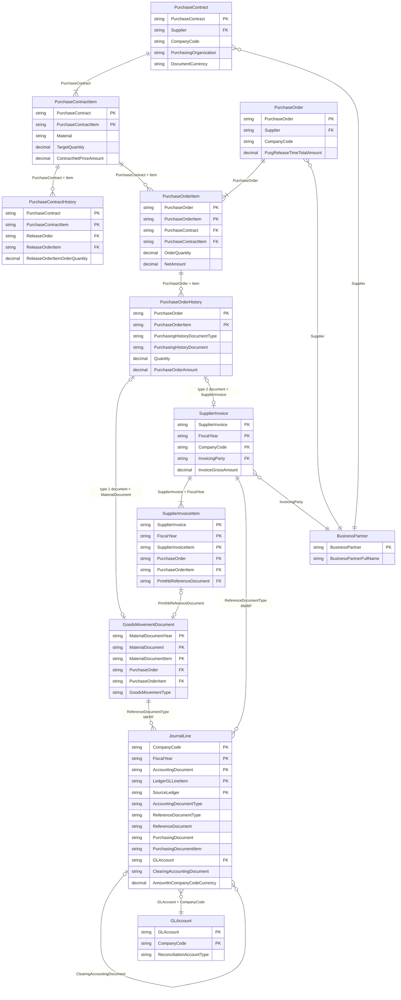

# Contract to Payment — entity diagram

The same diagram as a PowerPoint: [`CONTRACT_TO_PAYMENT_ER.pptx`](CONTRACT_TO_PAYMENT_ER.pptx). The version that starts at the requisition, including the contract, is [`REQUISITION_TO_PAYMENT_ER.pptx`](REQUISITION_TO_PAYMENT_ER.pptx).

Entity relationships for quantity contract **4600000041**, release purchase order **4500002146**, through goods receipt, supplier invoice, and payment **1500000000**. Field names are the CDS element names. Sample rows are in [`samples/c2p`](samples/c2p).

`ZEVO_C2P` exposes the purchasing entities with `$expand` ([`ZEVO_C2P.md`](ZEVO_C2P.md)). The journal and the payment are in `I_GLAccountLineItemRawData`. That view is not an entity set on `ZEVO_C2P` v1. There is no separate payment CDS: a payment is a journal document of type `KZ`, linked by `ClearingAccountingDocument`.

## How to read the links

| Relationship | Rule in this sample |
|---|---|
| Contract item to PO item | `PurchaseContract` + `PurchaseContractItem` |
| Contract history to PO | `ReleaseOrder` + `ReleaseOrderItem` is the purchase order |
| PO history type `1` | Goods receipt. `PurchasingHistoryDocument` is the material document. Movement type `101` |
| PO history type `2` | Invoice receipt. `PurchasingHistoryDocument` is the supplier invoice |
| Invoice item to goods receipt | `PrmthbReferenceDocument` when the PO item is goods-receipt-based |
| Material document to journal | `ReferenceDocumentType` = `MKPF` and `ReferenceDocument` = `MaterialDocument`. The FI document number is different |
| Supplier invoice to journal | `ReferenceDocumentType` = `RMRP` and `ReferenceDocument` = `SupplierInvoice` |
| Invoice journal to payment | Vendor line `ClearingAccountingDocument` = the `KZ` accounting document |

## Sample instance

| Entity | Keys in the sample |
|---|---|
| PurchaseContract | `4600000041` |
| PurchaseContractItem | `00020` TG20, `00030` TG11, `00010` TG10 not released |
| PurchaseOrder | `4500002146` |
| GoodsMovementDocument | `5000002931`, `5000002940`, `5000002941` |
| SupplierInvoice | `5100001598` (120.00), `5100001599` (40.50) |
| JournalLine, type WE | `5000000001`, `5000000002`, `5000000003` |
| JournalLine, type RE | `5100000000`, `5100000001` |
| JournalLine, type KZ | `1500000000` clears both vendor lines, 160.50 USD |
| BusinessPartner | `0001000559` EVOLVER DOMESTIC SUPPLIER 1 |
| GLAccount | `0013600000` stock, `0021120000` GR/IR, `0021100000` vendor, `0011002000` bank |
